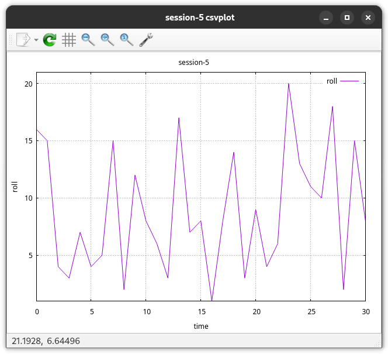
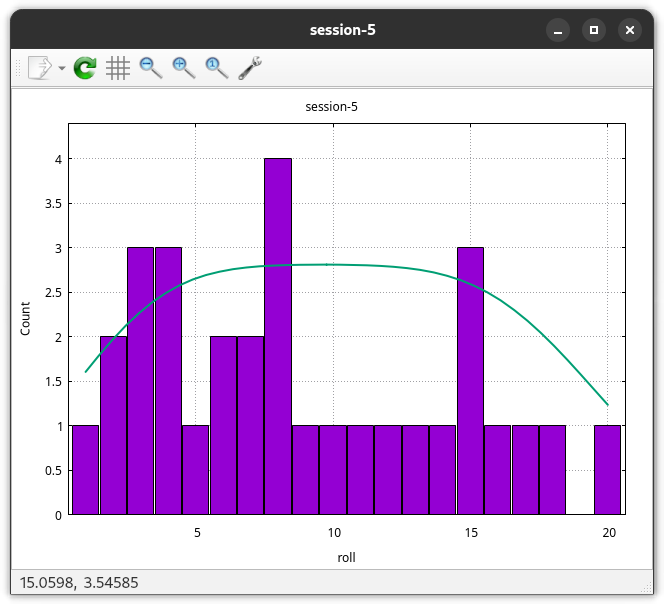
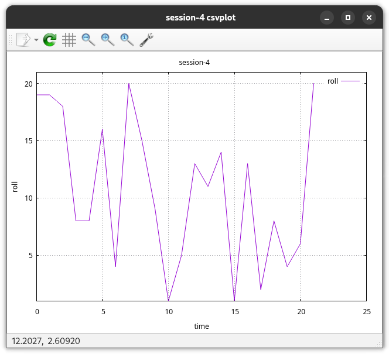
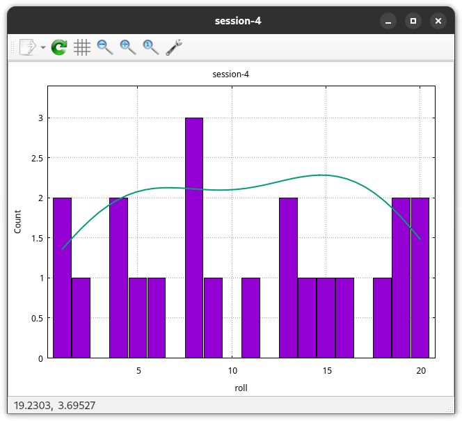
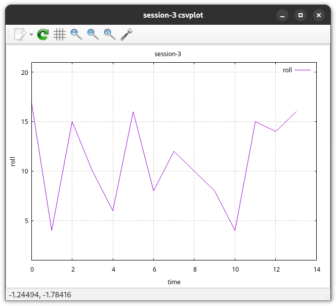
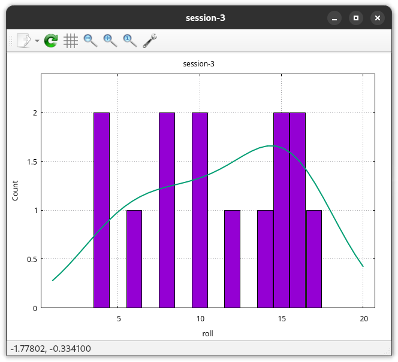
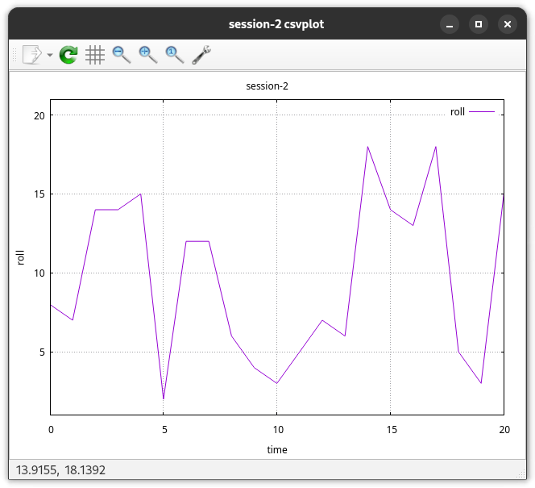
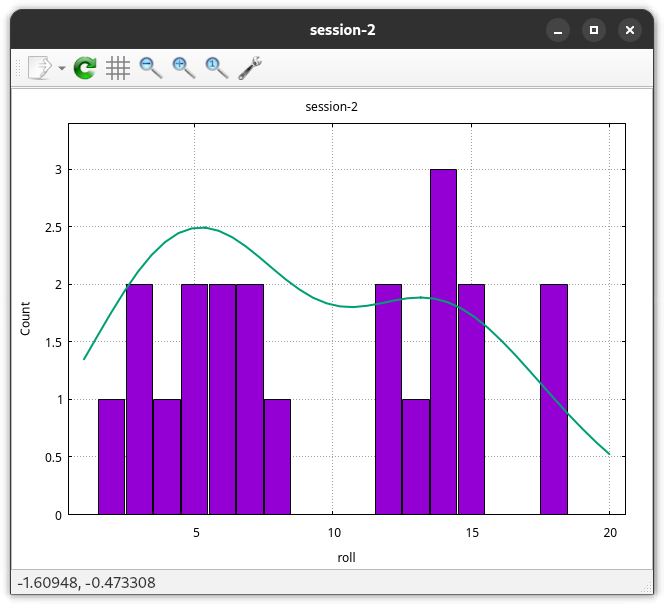
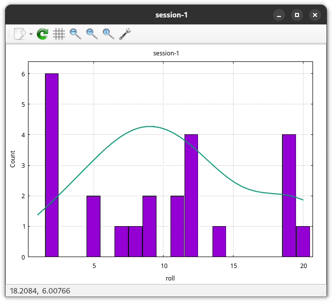

# D&D Roll Statistics

All d20 rolls manually recorded during the session, and processed afterwards.

# Sessions

## Session 5

```
count: 31
Q1: 4
median: 8
Q3: 14
min: 1 at index: 16
max: 20 at index: 23
mean: 8.838709677419354
stddev: 6.42245334888667
```





## Session 4

```
count: 22
Q1: 5
median: 10
Q3: 16
min: 1 at index: 10
max: 20 at index: 7
mean: 10.636363636363638
stddev: 7.967616409885619
```





## Session 3

```
count: 14
Q1: 8
median: 11
Q3: 15
min: 4 at index: 1
max: 17 at index: 0
mean: 11.071428571428571
stddev: 7.2068065475704195
```





## Session 2

```
count: 21
Q1: 5
median: 8
Q3: 14
min: 2 at index: 5
max: 18 at index: 14
mean: 9.571428571428573
stddev: 5.803823252952202
```





## Session 1

```
count: 24
Q1: 3.5
median: 10
Q3: 13
min: 2 at index: 0
max: 20 at index: 4
mean: 9.791666666666664
stddev: 6.93178623865251
```




# How to use

Add a new CSV to the `data/` directory, in a column named `roll`. Then run the `./generate.sh`
script on the new CSV. It require the `csvplot` and `csvstats` tools from
https://github.com/Notgnoshi/csvizmo to be installed somewhere in your `$PATH`

```sh
./generate.sh ./data/*.csv
```

# TODO

* [x] Script to automate statistics and plotting for each CSV
* [ ] Generate the README with a template and a script from any sessions in `data/`
