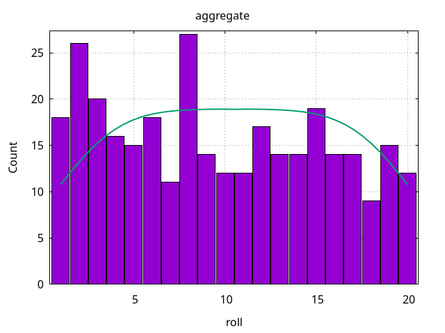
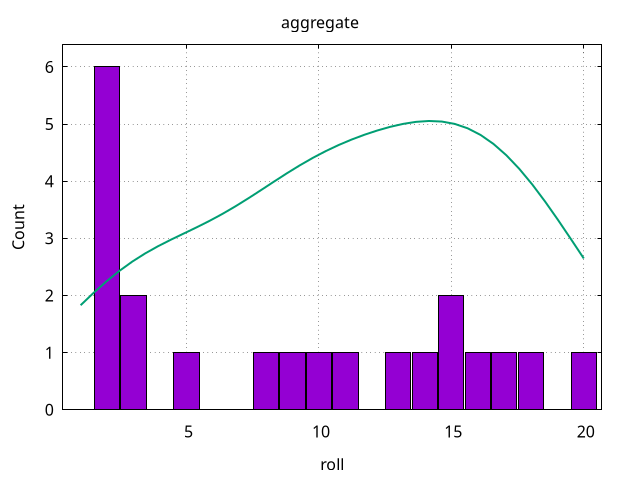
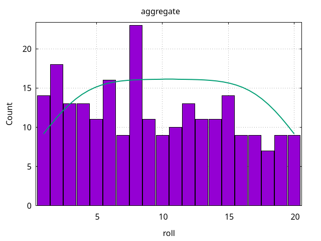

<!-- NOTE: This document is generated. Do not hand-edit! -->
# D&D Roll Statistics

This project tracks my d20 roll statistics for the Dungeons & Dragons games I participate in.

Table of contents:
* [Global Statistics](#global-statistics)
* Campaign Statistics
  * [one-shot-gang](#one-shot-gang-statistics)
  * [tyranny-of-dragons-1](#tyranny-of-dragons-1-statistics)
* [FAQ](#faq)

# Global Statistics

Here's a histogram of all aggregated rolls across all campaigns:



and the overall statistics:

| count | mean | stddev | Q1 | median | Q3 |
| --- | --- | --- | --- | --- | --- |
| 253 | 9.44 | 5.75 | 4 | 9 | 14 |

# Campaign Statistics

## one-shot-gang statistics

Here's a histogram of all aggregated rolls for the 'one-shot-gang' campaign:



and the per-session statistics:

| session | count | mean | stddev | Q1 | median | Q3 |
| --- | --- | --- | --- | --- | --- | --- |
| aggregate | 21 | 9 | 6.73 | 2 | 9 | 15 |
| [session-01](figures/one-shot-gang/sessions/session-01-histogram.png) | 21 | 9 | 6.73 | 2 | 9 | 15 |

## tyranny-of-dragons-1 statistics

Here's a histogram of all aggregated rolls for the 'tyranny-of-dragons-1' campaign:



and the per-session statistics:

| session | count | mean | stddev | Q1 | median | Q3 |
| --- | --- | --- | --- | --- | --- | --- |
| aggregate | 232 | 9.48 | 5.74 | 5 | 9 | 14 |
| [session-01](figures/tyranny-of-dragons-1/sessions/session-01-histogram.png) | 24 | 9.79 | 6.93 | 3.50 | 10 | 13 |
| [session-02](figures/tyranny-of-dragons-1/sessions/session-02-histogram.png) | 21 | 9.57 | 5.80 | 5 | 8 | 14 |
| [session-03](figures/tyranny-of-dragons-1/sessions/session-03-histogram.png) | 14 | 11.07 | 7.21 | 8 | 11 | 15 |
| [session-04](figures/tyranny-of-dragons-1/sessions/session-04-histogram.png) | 22 | 10.64 | 7.97 | 5 | 10 | 16 |
| [session-05](figures/tyranny-of-dragons-1/sessions/session-05-histogram.png) | 31 | 8.84 | 6.42 | 4 | 8 | 14 |
| [session-06](figures/tyranny-of-dragons-1/sessions/session-06-histogram.png) | 23 | 9.26 | 6.30 | 6 | 8 | 13 |
| [session-07](figures/tyranny-of-dragons-1/sessions/session-07-histogram.png) | 18 | 12.78 | 6.68 | 9 | 15 | 17 |
| [session-08](figures/tyranny-of-dragons-1/sessions/session-08-histogram.png) | 26 | 6.92 | 5.09 | 2 | 6 | 10 |
| [session-09](figures/tyranny-of-dragons-1/sessions/session-09-histogram.png) | 4 | 14.50 | 11.76 | 11 | 16 | 18 |
| [session-10](figures/tyranny-of-dragons-1/sessions/session-10-histogram.png) | 11 | 8 | 6.40 | 4 | 7 | 13 |
| [session-11](figures/tyranny-of-dragons-1/sessions/session-11-histogram.png) | 10 | 11.60 | 7.96 | 5 | 14.50 | 15 |
| [session-12](figures/tyranny-of-dragons-1/sessions/session-12-histogram.png) | 2 | 7 | 6.32 |  |  |  |
| [session-13](figures/tyranny-of-dragons-1/sessions/session-13-histogram.png) | 11 | 8.64 | 5.16 | 6 | 10 | 12 |
| [session-14](figures/tyranny-of-dragons-1/sessions/session-14-histogram.png) | 15 | 7.07 | 5.62 | 3 | 6 | 10 |

# FAQ

## What do I need to run the scripts in `./scripts/`?

* [csvizmo](https://github.com/Notgnoshi/csvizmo) installed in your `$PATH`
  * gnuplot
* csvtool
  * Fedora: `sudo dnf install ocaml-csv`
  * Ubuntu: `sudo apt install csvtool`

## How do I add a new session to an existing campaign?

1. Add a `session-<index>.csv` file to `data/<campaign>/sessions/`. The file should have two
   columns:

   * `session`: The session number
   * `roll`: The d20 roll value

2. Run the `./scripts/add_session.sh` script. It will discover the newly created session file and
   update the campaign statistics accordingly.

   ```sh
   ./scripts/add_session.sh
   ```

3. Sanity check the changes to the README:

   ```sh
   git diff README.md
   ```
4. Commit and push

## How do I add a new campaign?

1. Create `data/<campaign>/sessions/`
2. Create `figures/<campaign>/sessions/`
3. Add your campaign's first session with the process above
