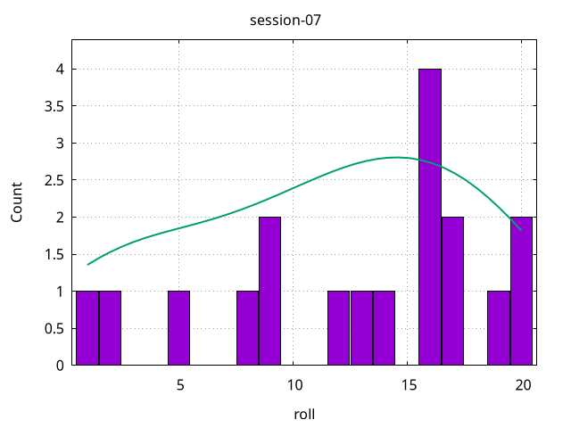

# D&D Roll Statistics

All d20 rolls manually recorded during the session, and processed afterwards.

# Sessions

## Session 14

```
count: 15
Q1: 3
median: 6
Q3: 10
min: 1 at index: 6
max: 17 at index: 4
mean: 7.0666666666666655
stddev: 5.616741144355383
```


## Session 13

```
count: 11
Q1: 6
median: 10
Q3: 12
min: 1 at index: 5
max: 14 at index: 9
mean: 8.636363636363637
stddev: 5.162815769196754
```


## Session 12

```
count: 2
min: 6 at index: 0
max: 8 at index: 1
mean: 7
stddev: 6.324555320336759
```

## Session 11

```
count: 10
Q1: 5
median: 14.5
Q3: 15
min: 1 at index: 0
max: 20 at index: 4
mean: 11.6
stddev: 7.960109356152035
```


## Session 10

```
count: 11
Q1: 4
median: 7
Q3: 13
min: 1 at index: 0
max: 17 at index: 7
mean: 8
stddev: 6.404290894543279
```


## Session 9

```
count: 4
Q1: 11
median: 16
Q3: 18
min: 8 at index: 3
max: 18 at index: 0
mean: 14.5
stddev: 11.763093571436485
```


## Session 8

```
count: 26
Q1: 2
median: 6
Q3: 10
min: 1 at index: 6
max: 19 at index: 20
mean: 6.9230769230769225
stddev: 5.088182523458802
```


## Session 7

```
count: 18
Q1: 9
median: 15
Q3: 17
min: 1 at index: 15
max: 20 at index: 10
mean: 12.777777777777777
stddev: 6.683600486859836
```




## Session 6

```
count: 23
Q1: 6
median: 8
Q3: 13
min: 1 at index: 3
max: 20 at index: 6
mean: 9.26086956521739
stddev: 6.3013162768387065
```


## Session 5

```
count: 31
Q1: 4
median: 8
Q3: 14
min: 1 at index: 16
max: 20 at index: 23
mean: 8.838709677419354
stddev: 6.42245334888667
```


## Session 4

```
count: 22
Q1: 5
median: 10
Q3: 16
min: 1 at index: 10
max: 20 at index: 7
mean: 10.636363636363638
stddev: 7.967616409885619
```


## Session 3

```
count: 14
Q1: 8
median: 11
Q3: 15
min: 4 at index: 1
max: 17 at index: 0
mean: 11.071428571428571
stddev: 7.2068065475704195
```


## Session 2

```
count: 21
Q1: 5
median: 8
Q3: 14
min: 2 at index: 5
max: 18 at index: 14
mean: 9.571428571428573
stddev: 5.803823252952202
```


## Session 1

```
count: 24
Q1: 3.5
median: 10
Q3: 13
min: 2 at index: 0
max: 20 at index: 4
mean: 9.791666666666664
stddev: 6.93178623865251
```


# How to use

Add a new CSV to the `data/` directory, in a column named `roll`. Then run the `./generate.sh`
script on the new CSV. It require the `csvplot` and `csvstats` tools from
https://github.com/Notgnoshi/csvizmo to be installed somewhere in your `$PATH`

```sh
./generate.sh ./data/*.csv
```

# TODO

* [x] Script to automate statistics and plotting for each CSV
* [ ] Generate the README with a template and a script from any sessions in `data/`
